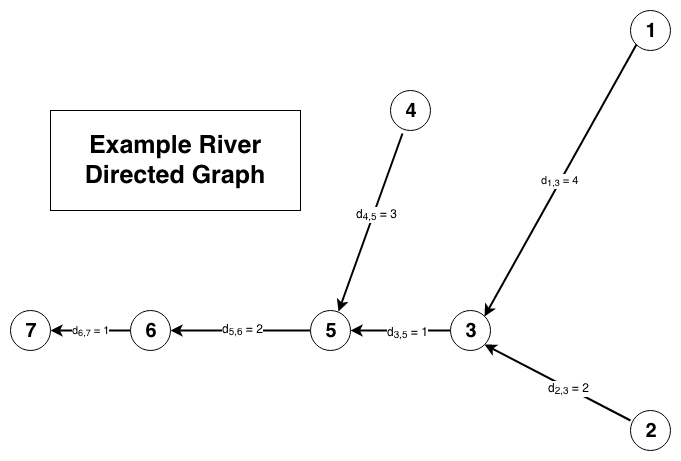
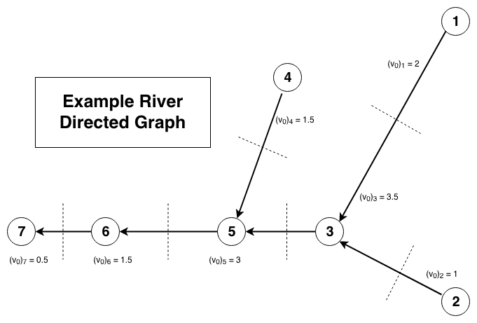

# River Flow Math

Let the following images be a graphical representation of an example river:
> 

This is a directed graph where each node is a circle (the inner number being it's label) and the arrows indicate
    the directional flow between nodes. Inside each arrow is a label indicating the distance between nodes.

### Assumptions
The following simplifying assumptions are being used:
  * The river has constant width.
  * The river has constant depth.

### Notation
Notationally we define _dn,m_ as the distance between adjacent nodes _n_ and _m_. If the nodes 
    _n_ and _m_ are not adjacent or if they are equal, then the distance between them is set to 0 for
    computational ease.

We can then construct a "distance matrix", _**D**_, between nodes. The following is the distance matrix associated with
    the example river:
>
Notice that this matrix is symmetric and zero along the diagonal.

Define _**v**k_ as the state vector where _(**v**k)j_ is the "volume" of water associated
    with node _j_ at time step _k_. To construct the initial state, _**v**0_ , we define:
>
This will "bin" the river by demarcating the nodes halfway between themselves and their adjacent nodes. The below
    diagram will clarify:
> 

Notice that for Node 1, the initial volume is _(**v**0)1_ = 2 since the only adjacent node is Node 3
    with _d1,3_ = 4. For Node 3, since there are several adjacent nodes, we sum over the half distances to
    these nodes and calculate
    
_(**v**0)3_
    = 0.5 * (_d3,1_ + _d3,2_ + _d3,5_)
    = 0.5 * (4 + 2 + 1)
    = 3.5

This is only an approximation for the "volume" of water at each node using the assumptions of a river of constant
    width and depth.

Finally there is a "step" vector _**u**_ where _(**u**)n_ is the distance of the water at Node n has
    travelled in that time step. This will be determined based upon the current gauge level of the node in a
    yet-to-be-determined way. When constructing the flow matrix, we assume the there is a constant
    step, _u_, for simplicity.

### Constructing the Flow Matrix
The flow matrix will be a matrix which depends on step vector _**u**_. We make the assumption that the flow matrix,
    _**F**_, will leave the initial state vector unchanged (when no rain is flowing into the river),
    i.e. _**Fv**0_ = **v**0. Each element of _**F**_, _Fij_, represents the percentage
    of the water in Node _j_ that flows to Node _i_. Therefore for all non-adjacent nodes _i_ and _j_,
    _Fij_ = 0.

We construct the flow matrix from upstream nodes to downstream nodes. For the most upstream nodes, there is no water
    flowing into the nodes from other nodes, and so for such a node _n_, the only nonzero element in row vector
    _**F**n_ will be _Fn,n_. If the proportion of water that flows from the source node is 
    _u(**v**0)n-1_, then it follows that
    _Fn,n_ = 1 - _u(**v**0)n-1_.

For those nodes, _m_, which are adjacent to the most upstream nodes, _n_, we have
    _Fm,n_ = _u(**v**0)n-1_.
Filling in the flow matrix for the example river with the information we know so far, we have:
>
where the starred values are currently undetermined.

We can solve for the starred value in row 3 in the following way:

Since this starred value should be in the form 1 - _u_ _k_ -1 for some real number _k_. Then,

_**F**3 &middot; v0_
    = 0.5*u(**v**0)1*
        + *u(**v**0)2*
        + (1 - _u_ _k_ -1)*(**v**0)3*
    = *(**v**0)3*

2*u* - 3.5*u**k* -1 + 3.5 = 3.5

*k* -1 = 2 / 3.5

and so the undetermined value is 1 - (2*u* / 3.5)

More generally, for any row _j_ with one undetermined or starred value, if we define:
>
then the undetermined value is equal to 1 - (*uCj* / *(v0)j* )

Finally, we notice that the columns of the flow matrix _**F**_ must sum to 1 (no water is lost in the flow). Therefore
    once we have completed a row, we can use this newly determined value to complete the corresponding column and
    iterate through until the matrix until all values are determined. This algorithm will complete since the river
    graph is fully connected and will not cycle since no cycles exist in the river graph.

The fully completed example flow matrix is as follows.
>

##### Additional Notes about the Flow Matrix
  * If you multiply the initial vector by this flow matrix you will _NOT_ return the initial state vector.
  This is because water is flowing away from the river source nodes without any upstream water flowing back into them.
  However, for all source nodes _k_ we replace row _**F**k_ with _**e**k_ (the source node remains
  constant), then the initial state vector _is_ an eigenvector with eigenvalue 1, for all values of _u_.
  
    * Rather than changing the Flow Matrix for an actual model, I believe that the better way to do this is to add
    an offset vector to _**Fv**_ to "fill up" these source nodes by a constant amount each time. A proposal
    offset vector is
    _**s**_ = _**Fv**0_ - _**v**0_ = (_**F**_ - _**I**_ )_**v**0_
  
  * As stated above, this flow matrix is mathematically valid for all values of _u_, however, would only physically
  be valid while each matrix element is non-negative. Therefore this puts a upper-bound on the time step of the model.